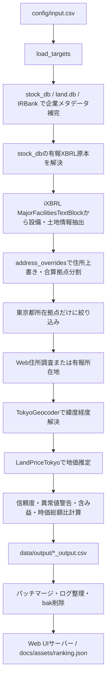

# ARCHITECTURE

> [!IMPORTANT]
>
> - Linuxかつ, Nixのdevshellを使用することが前提です.
> - `../stock_db` などの外部依存があります。詳細は [4.3 外部システム](#43-外部システム) を参照してください.
> - お気づきの点等ありましたら, PR/issue を作成して頂けるとありがたいです.

## 1. 全体像

### 1.1 目的

このリポジトリの主目的は、以下を自動化することである。

1. 証券コード一覧から企業名、有報XBRL原本、時価総額を取得または補完する。
2. 有報XBRLの「主要な設備の状況」から、事業所名、所在地、土地面積、土地簿価を抽出する。
3. 東京都内の所在地だけを対象に、街区レベルまたは町丁目レベルへジオコーディングする。
4. 公示地価・基準地価のGeoJSONを用いて、地点ごとの土地単価を推定する。
5. 土地面積と推定単価から推定土地時価、含み益、評価倍率、時価総額比を計算する。
6. 企業別CSVを生成し、Web UIでランキングを表示する。
7. 住所/地価 をCodex Skillsで 精度向上/合算拠点の分割 をする。根拠は調査メモとして保存する。

住所補完、地価推定はいずれも推定を含むため、出力には住所解決レベル、信頼度、異常値警告、近傍点情報などの監査用タグを含めている。

### 1.2 主要な設計方針

- **パイプライン制御はPython、重い空間検索はRust**  
  `run.py` と `src/` はI/O、XBRL解析、DBキャッシュ、Web取得、CSV出力、Web UI用データ生成を担当する。住所正規化、東京都ジオコーダ、地価近傍検索は PyO3 拡張 `land_value_core` に寄せる。

- **列定義とDBスキーマは単一の正に集約する**  
  企業別CSV列は `src/schema.py`、SQLiteスキーマは `src/land_db/schema.py` を正とする。列名を各所に散らさない。

- **処理途中で落ちても再起動する**  
  XBRL抽出結果、ジオコード結果、地価推定結果、Web住所解決結果をキャッシュする。メモリ制限で途中終了しても保存済みキャッシュと既存CSVから再開できる。

- **推定の根拠を出力に残す**  
  近傍地価点ID、距離、用途区分、k近傍単価、信頼度、住所取得元、異常値警告をCSVへ出す。Web UIにも住所解決タグ、信頼度、警告、調査メモを載せる。

- **手動補正を最優先で扱う**  
  エッジケースは `config/address_overrides.yaml` と `config/price_overrides.yaml` で上書きすることができる。

- **外部ネットワークは補完手段であり、結果はキャッシュする**  
  IRBank補完、Web住所調査、株価取得はスクレイピングをして取得している。有報XBRL原本の取得は `../stock_db` 側のEDINET API v2処理に集約する。
  外部サーバー負荷を軽減するためにDBに結果はキャッシュする。

## 2. リポジトリ構成

主要ディレクトリとファイルの責務は以下の通り。

| パス                 | 役割                                                                                                                                 |
| -------------------- | ------------------------------------------------------------------------------------------------------------------------------------ |
| `run.py`             | メインパイプライン。CLI解析、環境初期化、企業単位処理、キャッシュ、CSV出力、Web UI起動までを制御する。                               |
| `bin/land-value-run` | 推奨実行入口。Rust toolchain の有無を確認し、必要なら `nix develop` 経由で再実行し、Rustソース変更時に `uv` キャッシュをクリアする。 |
| `src/`               | Python側のライブラリ群。XBRL抽出、PDF表回帰テスト用抽出、Web住所調査、DBアクセス、会社メタデータ、ランキングデータ集約、異常検知、Web UI統合など。 |
| `src/land_db/`       | `data/land.db` のスキーマ、リポジトリ関数、Release asset取得処理。                                                                   |
| `src_ts/`            | フロントエンド TypeScript。`stock_web_ui` の共通ランタイムを使い、ランキング用カラム定義と指標設定を定義する。                        |
| `rust_src/`          | PyO3で公開するRust実装。東京都ジオコード、住所正規化、地価近傍検索、測地計算。                                                       |
| `scripts/`           | データ整備・補助調査・住所パッチマージ・land.db取得などの補助CLI。                                                                   |
| `tests/`             | Pythonテスト。XBRL抽出、PDF表回帰、住所正規化、地価推定、DB、ランキング、補正処理、ネットワーク耐性などを確認する。                    |
| `config/`            | 入力CSV、住所補正、地価補正、ブラウザ等の実行パラメータ。                                                                            |
| `data/geocoding/`    | 東京都ジオコーディング参照CSV。大字町丁目と街区の2種類を使う。                                                                       |
| `data/landprice/`    | 公示地価・基準地価の元データおよびマージ済みGeoJSON。                                                                                |
| `index.html`         | GitHub Pages のルートURLから `docs/` のWeb UIへ遷移させる入口。                                                                      |
| `docs/`              | Web UI用HTML、コンパイル済みJS、公開用ランキングJSON。`stock_web_ui` の共通テンプレートを使う。                                      |
| `split-address/`     | ランキング上位銘柄などの調査メモ。Web UIの「調査メモ」モーダルにも使われる。                                                          |
| `pyproject.toml`     | Python依存、maturinビルド設定、pytest/ruff設定。                                                                                     |
| `Cargo.toml`         | Rust crate `land_value_core` の依存とcrate設定。                                                                                     |
| `flake.nix`          | Nix dev shell。Python 3.13、Rust、uv、maturin、ruff、Node.jsを提供する。                                                             |

## 3. 実行入口

### 3.1 メインCLI

通常実行は次の形式で行う。

```bash
land-value-run --input config/input.csv
```

`land-value-run` は `bin/land-value-run` のbashスクリプトである。処理は以下の順に進む。

1. `rustc` が見つからない場合は `nix develop` で再実行する。
2. `rust_src/*.rs` と `Cargo.toml` のハッシュを `data/cache/.rust_src_hash` と比較する。
3. Rustソースが変わっていれば `uv cache clean land-value-research` を実行する。
4. `uv run --no-build-isolation python run.py ...` でPythonパイプラインを起動する。

### 3.2 `run.py`

`run.py` は `argparse` でCLIオプションを受け取る。主要オプションは以下である。

| オプション                       | 既定値        | 意味                                                                 |
| -------------------------------- | ------------- | -------------------------------------------------------------------- |
| `--input`                        | 空文字        | 入力CSV。空なら `config/input.csv`。                                 |
| `--output`                       | `data/output` | 企業別CSVの出力先。                                                  |
| `--price-method`                 | `idw`         | 地価推定方式。`idw` または `nearest`。                               |
| `--k`                            | `3`           | IDWで使う近傍点数。                                                  |
| `--p`                            | `3`           | IDWの距離減衰指数。                                                  |
| `--eps`                          | `1.0`         | IDWの距離ゼロ対策。                                                  |
| `--geocode-factor-gaiku`         | `1.0`         | 街区レベル住所の地価補正係数。                                       |
| `--geocode-factor-oaza-chome`    | `0.95`        | 町丁目レベル住所の地価補正係数。                                     |
| `--geocode-factor-muni-centroid` | `0.85`        | 市区町村重心住所の地価補正係数。                                     |
| `--allow-download`               | on            | 互換用。有報XBRL原本は `../stock_db` で事前取得する。                |
| `--allow-web-address`            | on            | Web公開情報による詳細住所補完を使う。                                |
| `--skip-processed`               | on            | 既存 `*_output.csv` の企業をスキップする。                           |
| `--allow-auto-metadata`          | on            | 会社名不足時にIRBank等で補完する。                                   |
| `--landuse-match`                | on            | 設備内容から用途ファミリーを推定し、用途区分を合わせて地価推定する。 |
| `--landuse-fallback-dist`        | `1500.0`      | 用途ファミリー最近傍が遠すぎる場合に全用途へ戻す距離。               |
| `--memory-limit`                 | `90`          | メモリ使用率が閾値を超えたらキャッシュ保存後に終了する。             |
| `--max-restarts`                 | `10`          | メモリ制限終了時の最大再起動回数。                                   |
| `--no-auto-restart`              | off           | 自動再起動ラッパーを無効化する。                                     |
| `--serve-ranking`                | on            | 完了後にWeb UIサーバーを起動する。`--no-serve-ranking` で無効化。    |

`main()` は標準出力と標準エラーをUTF-8に設定し、自動再起動が有効なら `_run_with_restart()` を挟む。実処理は `_main_worker()` と `_run_pipeline()` で行う。

### 3.3 Web UIサーバー

パイプライン完了後、`run.py` は後処理を済ませてから自動的に Web UI サーバーを起動する。単独で起動する場合は以下を使う。

```bash
uv run python -m src.web
```

`src/web.py` は以下を行う。

1. `src.ranking_data.collect_rank_rows()` でCSVからランキングデータを読み込む。入力ディレクトリは `str` / `Path` のどちらでも受け付ける。
2. `formula_screening.web.compute_all_stock_metrics()` でNCR, PER, 優先株有無, equity ratio, FCF yield, CROIC, PEG等を計算する。
3. 両者をマージしてJSON API (`/api/ranking`) として供給する。数値列は `_to_float_safe()` で str/float 両対応に変換する。変換失敗時は `logger.debug` で記録し `None` を返す。
4. `stock_web_ui.serve` でHTTPサーバーを起動し、`docs/index.html` を配信する。
5. GitHub Pages用には `uv run python -m src.web --export-json docs/assets/ranking.json` で同じJSON形状を書き出す。

フロントエンドは `src_ts/app.ts` でカラム定義を構成し、`stock_web_ui` の共通TypeScriptランタイム (`stock-table.js`) がテーブル描画、ソート、列表示切替、閾値カラー、リンク解決を行う。調査メモは `detailModal: true` で有効になるモーダル機能で表示する。

TypeScriptのコンパイルは `npx tsc` で行い、`docs/assets/app.js` が出力される。公開URLは `https://expgolemclone.github.io/land_value_research/` であり、ルートの `index.html` から `docs/` のWeb UIへ遷移する。

### 3.4 補助スクリプト

| スクリプト                           | 役割                                                                                          |
| ------------------------------------ | --------------------------------------------------------------------------------------------- |
| `scripts/merge_landprice.py`         | 公示地価 L01 と基準地価 L02 のGeoJSONを統合し、地価推定用GeoJSONを作る。                      |
| `scripts/parallel_research.py`       | ランキング上位銘柄を対象に、住所分割や低解像度住所改善の調査セッションを並列起動する。        |
| `scripts/merge_address_patches.py`   | `config/address_patches/` の住所パッチを `config/address_overrides.yaml` へ安全にマージする。 |
| `scripts/download_land_db.py`        | GitHub Release asset から `data/land.db` を取得する。                                         |
| `scripts/populate_company_master.py` | IRBankなどから `land.db` の企業メタデータを補完する。                                         |
| `scripts/populate_company_names.py`  | JPX銘柄名データを使って企業名を補完する。                                                     |
| `scripts/validate_ocr_accuracy.py`   | PDF抽出結果のOCR/表抽出精度を検証する補助。                                                   |
| `scripts/loop_runner.py`             | 繰り返し実行用の薄いランナー。                                                                |
| `scripts/_codex_precheck.py`         | 調査前に合算拠点・低解像度住所などを判定する補助。                                            |
| `scripts/_codex_geocode_check.py`    | 住所がどのジオコードレベルまで解決できるかを確認する補助。                                    |

## 4. 依存関係

### 4.1 Python依存

`pyproject.toml` の主要依存は以下である。

- `pdfplumber`: Web住所調査でPDF URLを渡された場合のテキスト化と、PDF表抽出ヘルパーの回帰テスト。
- `pyyaml`: 住所補正・地価補正YAMLの読み書き。
- `requests` / `pysocks`: 外部取得系の周辺依存。
- `shtab`: shell completion対応。
- `stock-db`: siblingリポジトリ `../stock_db` をeditable依存として参照する。
- `stock-web-ui`: siblingリポジトリ `../stock_web_ui`。共通Web UIランタイム (TypeScriptテーブル描画、列定義、HTTPサーバー) を提供する。
- `formula-screening`: siblingリポジトリ `../formula_screening`。`compute_all_stock_metrics()` でNCR, PER, equity ratio, FCF yield, CROIC, PEG等の指標を計算する。

dev依存は `pytest`、`hypothesis`、`maturin`、`ruff` である。

### 4.2 Rust依存

`Cargo.toml` の主要依存は以下である。

- `pyo3`: Python拡張 `land_value_core` の公開。
- `kiddo`: KdTreeによる近傍検索。
- `geojson` / `serde_json` / `serde`: 地価GeoJSONの読み取り。
- `proj4rs`: 経緯度から平面直角座標系への変換。
- `geographiclib-rs`: WGS84楕円体距離計算。
- `encoding_rs` / `csv`: 東京都ジオコーディングCSVのCP932/UTF-8読み取り。
- `regex` / `once_cell`: 住所正規化とパース用正規表現。

Rust crate名は `land_value_core` で、Pythonモジュール名も同じである。

### 4.3 外部システム

| 外部要素                  | 用途                                                | 実装箇所                                                            |
| ------------------------- | --------------------------------------------------- | ------------------------------------------------------------------- |
| `../stock_db`             | 会社名、有報XBRL原本、PDF URL、株価、発行済株式数、時価総額補完。 | `src/stock_db_sync.py`, `src/company_store.py`       |
| `../stock_web_ui`         | 共通Web UIランタイム、列定義、HTTPサーバー。        | `src/web.py`, `src_ts/app.ts`                                       |
| `../formula_screening`    | NCR, PER, FCF yield等の指標計算。                   | `src/web.py` → `compute_all_stock_metrics()`                        |
| BrowserService            | HTML取得、IRBank取得、Web住所調査。                 | `src/browser.py`, `src/web_address_research.py`                    |
| IRBank                    | 不足した会社名の補完。                              | `src/company_metadata_fallback.py`                                  |
| EDINET XBRL原本           | 有報の設備表抽出元。`../stock_db` のEDINET API v2取得済みZIP/展開ディレクトリを読む。 | `src/xbrl_extract.py`, `src/stock_db_sync.py` |
| GitHub Release asset      | `data/land.db` がない場合のDB取得。                 | `src/land_db/asset.py`                                              |
| 東京都ジオコーディングCSV | 住所から緯度経度への解決。                          | `rust_src/geocode_tokyo.rs`                                         |
| 公示地価・基準地価GeoJSON | 地価推定の点群データ。                              | `rust_src/landprice_tokyo.rs`                                       |

## 5. エンドツーエンド処理フロー

メインパイプラインの概略は以下である。



`run.py` 内部では次のフェーズに分かれる。

1. **環境初期化**  
   `setup_environment()` がパス、設定、DB、Rustジオコーダ、地価エンジン、BrowserService、WebAddressResearcherを構築する。

2. **補正変更によるCSV無効化**  
   `_invalidate_stale_override_csvs()` が住所補正と地価補正のハッシュを `invalidation_hashes` と比較し、該当企業CSVを削除する。

3. **入力とstock_db同期**
   `load_targets()` がCSVを読み、`sync_company_records_from_stock_db()`、`load_market_cap_from_stock_db()`、`load_stock_db_xbrl_artifacts()` が `stock_db` から不足情報と有報XBRL原本パスを補う。

4. **XBRL並列抽出**
   未キャッシュXBRLだけを `batch_extract_facilities_from_xbrl()` で `ProcessPoolExecutor` に渡し、設備土地情報と「主要な設備の状況」本文を並列抽出する。

5. **企業単位処理**
   `_process_company_with_retry()` が一時通信エラーを指数バックオフで再試行しながら `process_company()` を実行する。XBRL原本がない企業はPDFへ戻らずスキップする。

6. **企業別CSV出力**
   `_write_single_result()` が `OUTPUT_COLUMNS` 順で `*_output.csv` を書く。

7. **定期保存とメモリ対策**
   10社ごとに `save_caches()`、Web住所調査のメモリキャッシュクリア、GCを行う。メモリ監視スレッドは閾値超過時にDBコミット後、専用終了コードで終了する。

8. **後処理**
   `_post_pipeline_cleanup()` が住所パッチマージ、古いログ削除、`.bak` 削除を行う。

9. **Web UI表示**
    `--serve-ranking` が有効な場合、`src.web.serve_ranking()` が企業別CSVを集計し、ランキングWeb UIを起動する。

## 6. ランタイムコンテキスト

`run.py` の `RunContext` は、パイプライン全体で共有する依存を束ねるデータクラスである。

| フィールド :           | 内容                                                                  |
| ---------------------- | --------------------------------------------------------------------- |
| `args`                 | CLIオプション。地価推定方式、補正係数、ネットワーク可否などを含む。   |
| `base_dir`             | プロジェクトルート。                                                  |
| `cache_dir`            | `data/cache`。Web住所調査キャッシュ等の基準。                          |
| `output_dir`           | 企業別CSVの出力先。                                                   |
| `processed_lookup_dir` | 既存処理済みCSVの探索先。通常は `output_dir` と同じ。                 |
| `land_conn`            | `data/land.db` へのSQLite接続。                                       |
| `company_conn`         | 企業メタデータ用接続。現在は `land_conn` と同一。                     |
| `company_records`      | `company_metadata` を読み込んだインメモリ辞書。                       |
| `addr_overrides`       | `address_overrides.yaml` のロード結果。文字列上書きと分割指定を含む。 |
| `price_overrides`      | `price_overrides.yaml` のロード結果。                                 |
| `geocoder`             | Rust拡張 `TokyoGeocoder`。                                            |
| `web_addr`             | Web住所解決器 `WebAddressResearcher`。                                |
| `landprice`            | Rust拡張 `LandPriceTokyo`。                                           |
| `browser`              | `stock_db.browser_client` ベースの `BrowserService`。                 |
| `stock_db_market_caps` | `stock_db` から補完した時価総額。                                     |
| `stock_db_xbrl_artifacts` | `stock_db` から解決した有報XBRL原本。                              |
| `cache_lock`           | SQLite接続や共有キャッシュを保護する `threading.Lock`。               |

重要な制約は、重いRust処理はロック外で行い、SQLite読み書きだけをロック内に収めることである。`_geocode_address()` と `_estimate_price()` は double-checked locking で、キャッシュヒット時は即返し、ミス時は計算後にもう一度キャッシュを確認してから保存する。

## 7. 入力データ

### 7.1 入力CSV

既定入力は `config/input.csv` である。`--input` により差し替えられる。`load_targets()` はヘッダー付きとヘッダーなしの両方を受ける。

ヘッダー付きCSVで認識される主な列は以下である。

| 列                               | 意味                                                               |
| -------------------------------- | ------------------------------------------------------------------ |
| `code` / `証券コード` / `コード` | 証券コード。必須。                                                 |
| `company_name` / `銘柄名`        | 会社名。なければ `land.db`、`stock_db`、IRBankで補完される。       |
| `securities_report_pdf_url`      | 互換用の有報PDF URL。設備抽出には使わない。                        |
| `market_cap`                     | 時価総額。なければ `stock_db` の株価と発行済株式数から補完される。 |
| `address_source_urls`            | Web住所調査に使うURL。複数は `\|` 区切り。                         |

ヘッダーなしCSVでは1列目を証券コード、2列目を任意の会社名として扱う。

### 7.2 住所補正

`config/address_overrides.yaml` は企業コードごとの事業所補正を定義する。値には2形式がある。

1. **単純住所上書き**

```yaml
"1234":
  本社: 東京都千代田区丸の内1丁目1番1号
```

2. **合算拠点分割**

```yaml
"1234":
  本社及び支社:
    - name: 本社
      address: 東京都千代田区丸の内1丁目1番1号
      area_m2: 1000.0
      book_value_yen: 500000000
      area_m2_is_estimated: false
    - name: 支社等(全国合算)
      address: 全国各所
      area_m2: 9000.0
      area_m2_is_estimated: true
      area_m2_source: 有報注記
```

分割指定は `src/company_config.py` の `SiteSplitEntry` にパースされ、`expand_site_splits()` により `FacilityLand` のリストへ展開される。`book_value_yen` が省略された分割先には、未指定分の簿価が面積比で按分される。

分割は東京都フィルタ前に実行される。これにより、有報上は東京都を含む合算拠点だが、分割先に東京都外や全国各所が含まれるケースを正しく除外できる。

### 7.3 地価補正

`config/price_overrides.yaml` は企業コードと事業所名ごとの地価単価を直接指定する。

```yaml
"1234":
  本社: 1200000
```

地価補正がある場合、`_process_site()` はRust地価推定を使わず、指定単価をそのまま採用する。この場合、地価推定方法は `override`、信頼度は `override`、住所解像度補正係数は `1.0` になる。

### 7.4 地価データ

地価推定には `data/landprice/merged/L01_L02_merged_13.geojson` を使う。これは `scripts/merge_landprice.py` により、以下を統合して生成する。

- `data/landprice/tokyo_2025/L01-25_13.geojson`
- `data/landprice/chika_chousa_2024/L02-24_13.geojson`

Rust側はGeoJSONの `Point` featureを読み、主に以下の属性を使う。

| 属性      | 用途                                 |
| --------- | ------------------------------------ |
| `L01_001` | 都道府県コードなど、地価点IDの一部。 |
| `L01_002` | 地価点IDの一部。3桁ゼロ埋めされる。  |
| `L01_003` | 地価点IDの一部。3桁ゼロ埋めされる。  |
| `L01_008` | 地価単価。                           |
| `L01_051` | 用途区分。                           |

地価点IDは `L01_001-L01_002-L01_003` の形式で作られる。

### 7.5 ジオコーディング参照データ

東京都住所解決には次のCSVを使う。

- `data/geocoding/geocode_ref_oaza_chome_tokyo_2024/13_2024.csv`
- `data/geocoding/geocode_ref_gaiku_tokyo_2024/13_2024.csv`

Rust側 `TokyoGeocoder` は、CSVをCP932またはUTF-8として読み、次のインデックスを構築する。

| インデックス    | キー                                         | 値                            | 解決レベル      |
| --------------- | -------------------------------------------- | ----------------------------- | --------------- |
| `gaiku_index`   | `(市区町村名, 大字・丁目名, 街区符号・地番)` | `(緯度, 経度)`                | `gaiku`         |
| `oaza_first`    | `(市区町村名, 大字町丁目名)`                 | ソート後先頭の `(緯度, 経度)` | `oaza_chome`    |
| `muni_centroid` | `市区町村名`                                 | 町丁目点の平均緯度経度        | `muni_centroid` |

解決優先順は `gaiku`、`oaza_chome`、`muni_centroid` である。

## 8. 中間データモデル

### 8.1 `FacilityLand`

XBRL抽出結果の中心データ型は `src.pdf_extract.FacilityLand` である。PDF時代の型名を維持し、住所補正や下流処理との互換性を保っている。

| フィールド            | 内容                                                                 |
| --------------------- | -------------------------------------------------------------------- |
| `site_name`           | 事業所名。表の「事業所名」「名称」等から抽出する。                   |
| `location_short`      | 有報に載る所在地。多くは `東京都港区` など市区町村程度。             |
| `land_area_m2`        | 土地面積。表の単位に応じてm2へ換算される。                           |
| `land_book_value_yen` | 土地簿価。千円または百万円単位を円へ換算する。                       |
| `location_has_hoka`   | 所在地が「他」「ほか」「及び」「等」「外」など合算シグナルを持つか。 |
| `equipment_type`      | 設備の内容。用途区分推定に使う。                                     |

`FacilityLand` はXBRLからの素の抽出結果だけでなく、住所補正による分割後の仮想拠点にも使われる。

### 8.2 企業処理結果

`run.py` は企業ごとに `CompanyResult` を返す。

| フィールド         | 内容                                          |
| ------------------ | --------------------------------------------- |
| `code`             | 証券コード。                                  |
| `company_name`     | 会社名。                                      |
| `out_rows`         | CSVに書く行。個別拠点行と東京都合計行を含む。 |
| `sum_est`          | 東京都対象拠点の推定土地時価合計。            |
| `tokyo_site_count` | 東京都対象拠点数。                            |

内部の `_SiteResult` は、CSV行に加えて合計計算用の推定時価・簿価を保持する。

## 9. 出力スキーマ

### 9.1 CSV列の単一ソース

企業別CSVの列は `src/schema.py` の `OUTPUT_COLUMNS` が唯一の正である。`run.py` は `OUTPUT_FIELDNAMES = list(OUTPUT_COLUMNS)` としてこれを使い、ランキング側も同じ定数から列名を参照する。

CSV列は大きく以下のグループに分かれる。

| グループ   | 主な列                                                                                          |
| ---------- | ----------------------------------------------------------------------------------------------- |
| 企業・拠点 | `証券コード`, `企業名`, `事業所名`, `住所`, `住所取得元`, `住所取得元URL`                       |
| 住所解決   | `住所解決レベル`, `住所解像度補正係数`                                                          |
| 地価推定   | `地価単価(円/m2)`, `地価単価補正係数`, `地価単価算出方法`, `基準用途区分`, `最近傍用途区分`     |
| 近傍点監査 | `公示点ID`, `公示点距離(m)`, `k近傍ID`, `k近傍用途区分`, `k近傍距離(m)`, `k近傍単価(円/m2)`     |
| 信頼度     | `k近傍距離分散(m2)`, `k近傍最遠距離(m)`, `地価推定信頼度スコア`, `地価推定信頼度`, `異常値警告` |
| 評価額     | `土地面積(m2)`, `推定土地時価(円)`, `土地簿価(円)`, `含み益(円)`, `評価倍率`                    |
| 時価総額比 | `時価総額(円)`, `時価総額比(実値)`, `時価総額比`                                                |

列を追加、削除、改名、並べ替えする場合は、まず `src/schema.py` を変更し、`tests/test_schema_consistency.py` が期待する参照箇所を合わせる。

### 9.2 東京都合計行

`process_company()` は東京都対象拠点が0件でも、最後に `事業所名 = 東京都合計` の行を必ず追加する。ランキングデータ集約は原則この合計行を企業代表行として使う。合計行には個別住所、近傍点、信頼度などは入らず、企業単位の推定時価、簿価、含み益、評価倍率、時価総額比が入る。

### 9.3 Web UI用ランキングJSON

Web UI用JSONは `src.ranking_data.RankingRow` と `src.web.build_ranking_payload()` で構成する。主な項目は以下である。

| 項目                                    | 内容                                                     |
| --------------------------------------- | -------------------------------------------------------- |
| `code`, `name`                          | 企業識別情報。                                           |
| `ratio`                                 | CSVの実値を使ってソート可能な数値で出す。                |
| `memo_html`                             | `split-address/{code}.md` がある場合にモーダル表示する。 |
| `geocode_tag`, `confidence`, `anomaly`  | 企業内拠点の住所解決レベル、信頼度、警告を集約する。     |
| `estimated_value`, `market_cap` など    | 推定土地時価、時価総額、簿価、含み益の円単位数値。       |
| `metrics`                               | `formula_screening` 由来のNCR, PER, 優先株有無, FCF yield等。 |

`docs/index.html` はローカルサーバーでは `/api/ranking`、GitHub Pagesでは `docs/assets/ranking.json` を読み込む。GitHub Pages のルート `index.html` は `docs/` に遷移させる。

## 10. 永続化とキャッシュ

### 10.1 `data/land.db`

`data/land.db` はSQLiteデータベースである。存在しない場合、`src/land_db/asset.py` がGitHub Release assetから取得を試みる。空のSQLite DBを誤って作らないよう、呼び出し側はSQLite接続前に `ensure_land_db_exists()` を呼ぶ。取得処理中の一時ファイル削除失敗は警告ログとして出力し、処理は継続する。

スキーマは `src/land_db/schema.py` の `_LAND_SCHEMA_SQL` で定義される。

| テーブル              | 主キー              | 内容                                                                                         |
| --------------------- | ------------------- | -------------------------------------------------------------------------------------------- |
| `land_price_cache`    | `cache_key`         | 地価推定結果のJSON。緯度経度、方式、k、p、eps、用途区分を含むキーで保存する。                |
| `land_price_meta`     | `key`               | 地価推定依存のハッシュなど。                                                                 |
| `geocode_cache`       | `address`           | 住所から緯度経度と解決レベルへの解決結果。                                                   |
| `geocode_meta`        | `key`               | ジオコード依存のハッシュなど。                                                               |
| `facilities_land`     | `code`              | XBRL抽出された設備土地リスト、セクションテキスト、XBRL source fingerprint、キャッシュバージョン。 |
| `web_address_resolve` | `resolve_key`       | Web住所調査の成功またはミス。                                                                |
| `invalidation_hashes` | `(hash_type, code)` | 住所補正・地価補正の企業別ハッシュ。                                                         |
| `company_metadata`    | `code`              | 会社名、有報PDF URL、更新時刻。                                                              |

`init_land_db()` は `_migrate()` を先に実行し、旧スキーマからの移行を行う。現時点の移行では、`facilities_land.section_text` とXBRL source列追加、`web_address_resolve.resolved` 追加、旧 `web_address_resolve.address/score/source_url` の NOT NULL 制約除去、旧 `company_metadata.address_source_urls` 削除、旧 `market_cap_cache` 削除がある。

### 10.2 キャッシュ無効化

地価推定とジオコードは、参照データやRust実装が変わると過去結果が不正になる可能性がある。そのため `setup_environment()` で依存ハッシュを計算する。

| キャッシュ         | 依存ハッシュ                                | 変更時の動作                       |
| ------------------ | ------------------------------------------- | ---------------------------------- |
| `land_price_cache` | 地価GeoJSONと `rust_src/landprice_tokyo.rs` | テーブル全削除後、新ハッシュ保存。 |
| `geocode_cache`    | 街区CSVと `rust_src/geocode_tokyo.rs`       | テーブル全削除後、新ハッシュ保存。 |

住所補正と地価補正は企業単位で無効化する。`_invalidate_stale_override_csvs()` は補正内容をJSON化してハッシュ化し、`invalidation_hashes` と差分がある企業の既存CSVを削除する。これにより `--skip-processed` が有効でも補正済み企業は再処理される。

### 10.3 XBRL抽出キャッシュ

有報XBRL原本は `../stock_db/var/raw/edinet/xbrl/{ticker}/{doc_id}.zip` と展開済みディレクトリを正とする。land側は原本をコピーせず、`facilities_land` に抽出結果と source fingerprint を保存する。

Web住所調査では同じ原本から抽出済みの「主要な設備の状況」本文を `ctx.web_addr.seed_text()` で渡し、EDINET PDFを住所調査のために再取得しない。

### 10.4 Web住所調査キャッシュ

`WebAddressResearcher` は以下を持つ。

- URL本文のファイルキャッシュ: `data/cache/web_address/{md5(url)}`
- 解析結果キャッシュ: `data/cache/web_address/{md5(url)}.analysis.json`
- 解決結果DBキャッシュ: `land.db` の `web_address_resolve`
- プロセス内メモリキャッシュ: URL本文テキストと抽出住所リスト

解析結果JSONには、元ファイルのサイズとmtime、抽出テキスト、住所候補が入る。元ファイルが変わった場合は再解析される。

## 11. 有報XBRL抽出設計

`src/xbrl_extract.py` は `../stock_db` がEDINET API v2で取得した有報XBRL原本を読み、iXBRLの `MajorFacilitiesTextBlock` から土地情報を抽出する。`src/pdf_extract.py` の表ヘッダー解析と行抽出ロジックは回帰テスト資産として残し、XBRL側のHTML tableを同じ行列形式へ変換して再利用する。

### 11.1 XBRL原本解決

`src/stock_db_sync.py` の `load_stock_db_xbrl_artifacts()` は `stock_db.sec_reports` から `fiscal_year='latest'` を優先して `doc_id` と `xbrl_path` を取得する。`xbrl_path` ディレクトリ、対応する `{doc_id}.zip`、本文系ファイルが揃っている場合だけ有効な原本として扱う。

抽出キャッシュは `facilities_land.source_kind/source_id/source_size/source_mtime_ns/cache_version` で無効化する。旧PDFキャッシュとは source_kind と cache_version が異なるため再利用されない。

### 11.2 セクション検出

`extract_facilities_from_xbrl()` は `XBRL/PublicDoc` 配下の `.htm` / `.html` / `.xhtml` を読み、`ix:nonNumeric` の `name` が `MajorFacilitiesTextBlock` の要素を抽出対象にする。セクション本文はWeb住所補完用のテキストとして `WebAddressResearcher.seed_text()` に渡し、EDINET PDF URLを住所補完のために再取得しない。

### 11.3 HTML table正規化

iXBRLのtableは `rowspan` / `colspan` を持つため、`_html_table_to_grid()` がPDF由来テーブルと同じ `list[list[str | None]]` に変換する。注記と実数値が別行に分かれるXBRL表は `_merge_continuation_rows()` で同一データ行に結合する。

### 11.4 ヘッダー解析

設備表は会社ごとにヘッダー構造が異なるため、固定列番号ではなく、以下の手順で列役割を推定する。

1. `_estimate_header_rows()` が1行ヘッダーか2行ヘッダーかを推定する。
2. `_parse_group_headers()` がセル結合を考慮し、各列の `(group, sub)` ペアを作る。
3. `_detect_columns()` が事業所名、所在地、設備内容、土地簿価、土地面積の列を検出する。
4. 帳簿価額単位は `_book_multiplier()`、面積単位は `_area_scale()` で判定する。

土地簿価と面積が同一セルにある標準形式、面積列と簿価列が分かれている形式の両方を扱う。

### 11.5 行抽出

各データ行から次を抽出する。

- `site_name`: 事業所名セルから所在地や注記を除いた名称。
- `location_short`: 所在地列または事業所名セル内の都道府県・市区町村。
- `location_has_hoka`: 所在地直後に「他」「等」「外」「ほか」「及び」などがあるか。
- `equipment_type`: 設備内容列。
- `land_book_value_yen`: 簿価を円へ換算。
- `land_area_m2`: 面積をm2へ換算。

東京都所在地で面積が抽出できない場合は警告を出す。土地簿価がない行、所在地が取れない行、合計/小計行、特定条件での本社行はスキップされる。

### 11.6 並列抽出

`batch_extract_facilities_from_xbrl()` は複数XBRL原本を `ProcessPoolExecutor` で並列処理する。XML/HTML解析をプロセス並列に分離するためである。Windowsでは `ProcessPoolExecutor` の上限に合わせ、最大worker数を61に制限する。XBRLが1件だけならプロセス起動オーバーヘッドを避け、直接抽出する。

## 12. 会社メタデータと時価総額

### 12.1 メタデータの優先順位

企業名は次の順で取得される。

1. 入力CSVの `company_name`
2. `land.db` の `company_metadata`
3. sibling `stock_db` の `stocks`
4. `--allow-auto-metadata` 有効時のIRBank補完

IRBank補完は `src/company_metadata_fallback.py` の `fetch_from_irbank()` が担当する。XBRL移行後の有報設備抽出は `stock_db.sec_reports.xbrl_path` を必須とし、PDF URLだけでは処理しない。通信断などで空になった結果を固定化しないため、完全失敗時の空結果はキャッシュしない。

### 12.2 時価総額

時価総額は次の順で解決される。

1. 入力CSVの `market_cap`
2. `stock_db` の `stocks.shares_outstanding` と最新 `prices.close` の積

`load_market_cap_from_stock_db()` は最新株価日が既定7日より古い場合、その銘柄を採用しない。不足がある場合、`run_stooq_scrape()` が `../stock_db` で `uv run scrape-stooq-prices` を実行し、再取得を試みる。

時価総額が最後まで解決できない企業は `CompanySkipError` でスキップされる。

## 13. 住所解決設計

### 13.1 住所の優先順位

`_process_site()` は事業所ごとに住所を次の順で決める。

1. `address_overrides.yaml` の上書き住所。
2. `--allow-web-address` 有効時、Web住所調査で採用基準を満たした住所。
3. 有報XBRLから抽出した `location_short`。

住所取得元はCSVの `住所取得元` に `override`、`web`、`securities_report` として出力される。Web住所の場合は `住所取得元URL` に採用候補のURLを入れる。

### 13.2 Web住所調査

`WebAddressResearcher.resolve()` は、事業所名、有報所在地、候補URL群から住所候補を抽出し、スコアリングする。

処理概要は以下である。

1. 入力を正規化し、`resolve_key` を作る。
2. `web_address_resolve` に成功またはミスがあれば返す。
3. URLが複数ある場合、最大4スレッドで本文取得と候補抽出を先行する。
4. HTMLはタグを落としてテキスト化する。XBRLの「主要な設備の状況」本文は抽出済みテキストを直接使う。
5. `東京都...` を含む行から、丁目、番、号、ハイフン番地などを持つ候補だけを抽出する。
6. 所在市区町村一致、短縮所在地一致、番地粒度、事業所名近傍出現などでスコアを付ける。
7. 最高スコア候補をDBへ保存する。候補がなければミスとして保存する。

採用可否は `src/anomaly.py` の `should_accept_web_address()` が決める。合算拠点名、所在地に合算シグナルがある行、スコア40未満の候補は採用しない。

### 13.3 東京都ジオコーダ

Rustの `TokyoGeocoder.geocode()` は、住所正規化後に東京都の区市町村を抽出し、町名、丁目、街区番号を粗くパースする。

代表的な入力例と解決方針は以下である。

| 入力例                             | パース                            | 期待レベル      |
| ---------------------------------- | --------------------------------- | --------------- |
| `東京都中央区日本橋兜町11番5号`    | 町名 `日本橋兜町`, 街区 `11`      | `gaiku`         |
| `東京都港区六本木3-4-33`           | 町名 `六本木`, 丁目 `3`, 街区 `4` | `gaiku`         |
| `東京都千代田区二番町`             | 町名のみ                          | `oaza_chome`    |
| `東京都八王子市...` で町丁目不一致 | 市区町村のみ                      | `muni_centroid` |

住所正規化では、全角数字、全角ダッシュ、漢数字丁目・番・号、郵便番号記号などを扱う。番町など、丁目なし番地のパターンもテストでカバーされている。

### 13.4 住所解像度補正

ジオコード解決レベルに応じて、地価単価に補正係数を掛ける。

| 解決レベル      | 既定係数 | 理由                                     |
| --------------- | -------- | ---------------------------------------- |
| `gaiku`         | `1.0`    | 街区レベルで比較的精度が高い。           |
| `oaza_chome`    | `0.95`   | 町丁目代表点なので、個別街区より不確実。 |
| `muni_centroid` | `0.85`   | 市区町村重心で粗いため、大きく割り引く。 |

係数はCLIオプションで変更できる。

## 14. 地価推定設計

### 14.1 Rust側データ構造

`rust_src/landprice_tokyo.rs` の `LandPriceTokyo` はGeoJSONから地価点を読み、以下を構築する。

- 全地価点 `points`
- 地価点IDからインデックスへの `point_idx_by_id`
- 全点KdTree `tree_all`
- 全点グローバルインデックス `all_idx`
- 用途区分別および用途ファミリー別のサブKdTree `landuse_trees`

各地価点は、緯度経度、平面直角座標、単価、地価点ID、用途区分を持つ。KdTree検索は平面直角座標系で候補を高速に絞り、最終距離はWGS84楕円体距離で計算する。

### 14.2 距離計算

`rust_src/coord.rs` は2種類の距離関連処理を持つ。

- `lonlat_to_plane()`: WGS84経緯度を EPSG:6677 相当の平面直角座標系第IX系へ変換する。
- `ellipsoid_distance()` / `ellipsoid_distances()`: WGS84楕円体上の距離をメートルで計算する。

KdTreeは近傍候補探索用、楕円体距離は出力や最終順位決定用である。

### 14.3 `nearest`

`nearest(lat, lon, landuse_kind=None)` は、指定用途区分のツリーがあればそれを使い、なければ全点ツリーへフォールバックする。候補を数件取得し、楕円体距離で最短点を選ぶ。同距離タイでは `point_id` の辞書順で決定し、結果を安定化する。

返り値は `PriceResult` で、単価、最近傍ID、最近傍距離、k近傍相当のリストを含む。

### 14.4 `idw`

`idw(lat, lon, k=3, p=3.0, eps=1.0, landuse_kind=None)` は逆距離加重平均を行う。

重みは次である。

```text
w_i = 1 / (d_i + eps)^p
unit_price = sum(w_i * price_i) / sum(w_i)
```

候補はKdTreeで `k + 2` 程度取得し、楕円体距離、同距離時は `point_id` で安定ソートした上位 `k` 件を使う。`k == 0` はエラーである。

### 14.5 用途区分マッチ

`--landuse-match` が有効な場合、`_process_site()` は設備内容から用途ファミリーを推定する。

| 用途ファミリー | 例                                                       |
| -------------- | -------------------------------------------------------- |
| 工業系         | 工場、倉庫、物流、配送、タンク、プラント、生産、油槽など |
| 商業系         | 事務所、本社機能、店舗、営業所、ホテル、賃貸ビルなど     |
| 住居系         | 社宅、寮、社員寮、賃貸マンションなど                     |

まず用途ファミリーツリーで最近傍点を探し、その距離が `--landuse-fallback-dist` を超える場合は全用途ツリーの最近傍点に戻す。最終的に採用した最近傍点の用途区分を `target_landuse_kind` とし、その用途区分だけで `nearest` または `idw` を実行する。

この設計により、工場用地を商業地の近傍点だけで過大評価するなどの誤差を抑える。ただし用途分類は設備内容キーワードベースなので、CSVの `基準用途区分` と `最近傍用途区分` を必ず確認できるようにしている。

### 14.6 地価推定キャッシュキー

地価推定キャッシュのキーは次の要素から作られる。

- 緯度
- 経度
- `price_method`
- `k`
- `p`
- `eps`
- `target_landuse_kind`

緯度経度と `eps` は小数15桁で文字列化される。CLIオプションや用途区分が変われば別キャッシュになる。

## 15. 信頼度と異常値警告

`src/anomaly.py` は推定結果を監査するための軽量ルールを持つ。

### 15.1 信頼度スコア

`calc_uncertainty_metrics()` は `PriceResult` のk近傍距離から以下を計算する。

- 距離分散 `dist_var`
- k近傍の最遠距離 `max_dist`
- 信頼度スコア `score`
- 信頼度ラベル `high` / `medium` / `low`

スコアは、最遠距離と距離分散を参照値で0から1へ正規化し、重み付きで減点する。

| 定数                                    | 意味               |
| --------------------------------------- | ------------------ |
| `UNCERTAINTY_MAX_DIST_REF_M = 5000`     | 最遠距離の参照値。 |
| `UNCERTAINTY_DIST_VAR_REF_M2 = 1000000` | 距離分散の参照値。 |
| `UNCERTAINTY_WEIGHT_MAX_DIST = 0.7`     | 最遠距離の重み。   |
| `UNCERTAINTY_WEIGHT_DIST_VAR = 0.3`     | 距離分散の重み。   |
| `CONFIDENCE_THRESHOLD_HIGH = 0.67`      | high判定閾値。     |
| `CONFIDENCE_THRESHOLD_MEDIUM = 0.34`    | medium判定閾値。   |

### 15.2 異常値警告

個別拠点に対して、以下のような警告を付与する。

| 条件                            | 警告                                  |
| ------------------------------- | ------------------------------------- |
| 所在地に合算シグナルがある      | `所在地に複数所在地シグナルを含む...` |
| 解決レベルが `muni_centroid`    | `muni_centroid`                       |
| 解決レベルが `oaza_chome`       | `oaza_chome`                          |
| k近傍最遠距離が10000m以上       | `k近傍最遠距離10000m以上`             |
| 信頼度lowかつ土地面積5000m2以上 | `信頼度lowかつ土地面積5000m2以上`     |
| 評価倍率が500倍以上             | `評価倍率閾値超過`                    |

さらに企業内で同一住所に複数拠点があり、合計面積が50000m2以上の場合、`同一住所かつ大面積の複数拠点` を該当行に追加する。

警告は推定を止めるものではなく、ランキング確認時に優先調査すべき対象を浮かび上がらせるための情報である。

## 16. ランキングデータとWeb UI

`src/ranking_data.py` は、企業別CSVを読み込み、時価総額比ランキング用の行データを生成する。静的HTMLのランキング生成は廃止し、表示は `src/web.py` と `docs/` のWeb UIに一本化する。

### 16.1 企業代表行の選択

`pick_company_row()` は以下の順で代表行を選ぶ。

1. `事業所名 = 東京都合計` の行があれば、その中から時価総額比が最大の行。
2. 合計行がなければ、全行から時価総額比が最大の行。

通常は `run.py` が必ず東京都合計行を出すため、企業単位ランキングになる。

### 16.2 会社名補正

CSV内の企業名が空、または証券コードと同じ場合、`company_metadata` の会社名を使う。会社メタデータの補完はパイプライン側の `stock_db` 同期とIRBank補完で行う。

### 16.3 調査メモ

`split-address/{code}.md` が存在する場合、ランキングJSONの `memo_html` にMarkdownを簡易HTML変換した内容を入れる。Web UIは `detailModal: true` のモーダルで表示する。

この仕組みは、合算拠点分割や住所根拠の調査履歴をランキング閲覧時に確認するためのものである。

### 16.4 公開用JSON

GitHub Pages用の静的データは `docs/assets/ranking.json` である。`src/web.py --export-json` はローカルサーバーの `/api/ranking` と同じpayloadを書き出し、`docs/index.html` はGitHub Pages上ではこのJSONを読み込む。リポジトリルートは `index.html` で `docs/` へ遷移させる。

## 17. 補助調査と住所パッチ

住所精度改善は通常、ランキング結果から優先対象を選び、`scripts/parallel_research.py` で進める。

### 17.1 `split-address`

`split-address` モードは、時価総額比上位などから合算拠点を選び、調査セッションを起動する。出力は主に以下である。

- `split-address/{code}.md`: 調査メモ。
- `config/address_patches/*.yaml`: `address_overrides.yaml` へマージする住所パッチ。

合算拠点の分割では、単に東京都住所へ寄せるのではなく、全国各所や他県に属する面積を分離し、東京都評価から除外できるようにする。

### 17.2 `resolve-address`

`resolve-address` モードは、`muni_centroid` や `oaza_chome` で止まっている住所を調査し、街区レベルに近づけるための住所補正を作る。

### 17.3 パッチマージ

`scripts/merge_address_patches.py` の `merge_patches_safe()` は、パイプライン後処理で自動実行される。パッチを `config/address_overrides.yaml` にマージし、古い `.bak` は後処理で削除される。

## 18. エラー処理と再実行性

### 18.1 企業単位のスキップ

企業処理で回復不能な不足がある場合は `CompanySkipError` を使う。代表例は以下である。

- 会社名が解決できない。
- 有報XBRL原本が `stock_db` にない。
- 有報XBRL原本の展開ディレクトリやZIPが壊れている。
- 時価総額が解決できない。

スキップされた企業はログに残り、パイプライン全体は継続する。

### 18.2 一時通信エラー

Web住所調査などで一時的な通信エラーと判定できる場合は `TransientNetworkError` として扱い、`_process_company_with_retry()` が最大3回、指数バックオフで再試行する。

`src/network.py` の `is_transient_network_error()` は、HTTP 408、425、429、500、502、503、504、タイムアウト、ソケットエラー、接続エラーなどを一時エラーとみなす。

### 18.3 メモリ制御

`_memory_watchdog()` は一定間隔でメモリ使用率を確認し、CLIの `--memory-limit` を超えたらキャッシュを保存して `EXIT_CODE_MEMORY_LIMIT = 75` でプロセスを終了する。

自動再起動が有効な場合、親プロセス `_run_with_restart()` は終了コード75を検出し、数秒後にワーカーを再起動する。`--max-restarts` で回数上限を設定できる。

この仕組みは、大量XBRL処理やブラウザ取得でメモリが膨らんだ場合でも、既存CSVとDBキャッシュを使って進行を継続するためのものである。

## 19. 並行性とスレッド安全性

### 19.1 SQLite

`run.py` は `sqlite3.connect(..., check_same_thread=False)` で `land.db` を開き、`PRAGMA journal_mode=WAL` と `PRAGMA foreign_keys=ON` を設定する。共有接続へのアクセスは `ctx.cache_lock` で保護する。

`WebAddressResearcher` は内部で別のSQLite接続を持ち、自身の `_lock` で保護する。DBファイルは同じ `land.db` を指す場合があるため、WAL前提で短いトランザクションを保つ。

### 19.2 Rustオブジェクト

`TokyoGeocoder` と `LandPriceTokyo` は初期化後に内部状態を変更しない読み取り中心のオブジェクトとして扱われる。`_geocode_address()` と `_estimate_price()` は、重いRust計算を `cache_lock` の外で行う。

### 19.3 XBRL抽出

XBRL抽出はプロセス並列であり、各ワーカーは独立してXBRL原本を読む。SQLiteへの保存は親プロセス側で行う。

### 19.4 Web住所調査

Web住所調査はI/O boundなので、URLが複数ある場合は `ThreadPoolExecutor` で最大4並列取得する。本文キャッシュと住所候補キャッシュは `WebAddressResearcher` インスタンス内で管理される。

## 20. セキュリティとネットワークガード

外部URL取得前には `src/utils.py` の `validate_url_not_private()` を通す。これはローカルアドレスやプライベートネットワークへのアクセスを避けるためのガードである。

このガードが使われる主な箇所は以下である。

- `src/web_address_research.py` のHTML/PDF取得。
- `src/company_metadata_fallback.py` のIRBank取得。

`BrowserService` は `stock_db.browser_client` を継承し、`config/magic_numbers.toml` の `[browser]` 設定を使う。`headless`、タイムアウト、プールサイズなどはこの設定で調整する。

## 21. 開発・検証

### 21.1 推奨環境

推奨はNix dev shellである。

```bash
nix develop
```

dev shellには以下が含まれる。

- Python 3.13
- Rust toolchain
- cargo / clippy / rustfmt
- maturin
- uv
- ruff
- Node.js

`pyproject.toml` は `../stock_db` をeditable依存として参照するため、通常の実行・テストでは sibling リポジトリが必要である。

### 21.2 テスト

Pythonテストは以下で実行する。

```bash
uv run pytest
```

主なテスト範囲は以下である。

| テスト                                                    | 対象                                                          |
| --------------------------------------------------------- | ------------------------------------------------------------- |
| `tests/test_xbrl_extract.py`                              | XBRL設備表抽出、rowspan/colspan、所在地・数値パース。          |
| `tests/test_pdf_extract.py` / `test_pdf_extract_props.py` | PDF時代から継承した表抽出ヘルパーの回帰。                      |
| `tests/test_jp_address.py` / `test_jp_address_props.py`   | 住所正規化、町丁目・街区パース。                              |
| `tests/test_geocode_tokyo.py`                             | 東京都ジオコーダの解決レベル。                                |
| `tests/test_landprice_tokyo.py`                           | 地価推定、nearest、IDW、用途フィルタ。                        |
| `tests/test_land_db.py`                                   | SQLiteキャッシュと移行。                                      |
| `tests/test_company_config.py` / `test_site_split.py`     | 住所補正、合算拠点分割、簿価按分。                            |
| `tests/test_ranking_data.py`                              | ランキング行選択とMarkdown変換。                              |
| `tests/test_web.py`                                       | Web UI用JSON payloadと静的JSON export。                       |
| `tests/test_schema_consistency.py`                        | 列定義のSSOTが守られているか。                                |
| `tests/test_network_resilience.py`                        | 一時通信エラー、メタデータキャッシュ、Web取得失敗キャッシュ。 |
| `tests/test_guardrails.py`                                | Web住所採用ガード。                                           |

### 21.3 Lint

Python lintは以下で実行する。

```bash
uv run ruff check .
```

`pyproject.toml` では `data/` と `scripts/validate_ocr_accuracy.py` がruff対象外である。

### 21.4 Rustテスト

Rust単体テストは必要に応じて以下で実行する。

```bash
cargo test
```

ただし通常のPythonテストでもmaturin経由でRust拡張を使うため、主要なPython公開面はPythonテストで確認される。

## 22. 変更時の注意点

### 22.1 CSV列を変更する場合

1. `src/schema.py` の `OUTPUT_COLUMNS` を変更する。
2. `run.py`、`src/ranking_data.py`、テストが列定数を使っているか確認する。
3. `tests/test_schema_consistency.py` を更新する。
4. 既存 `data/output/*_output.csv` とWeb UI用JSONの互換性を考える。必要なら再生成する。

### 22.2 DBスキーマを変更する場合

1. `src/land_db/schema.py` の `_LAND_SCHEMA_SQL` を変更する。
2. 既存DBからの移行を `_migrate()` に追加する。
3. `src/land_db/repo.py` に読み書き関数を追加または変更する。
4. `tests/test_land_db.py` に移行と読み書きのテストを追加する。
5. Release assetとして配る `land.db` との互換性を確認する。

### 22.3 住所ジオコードを変更する場合

1. `rust_src/jp_address.rs` または `rust_src/geocode_tokyo.rs` を変更する。
2. `tests/test_jp_address.py`、`tests/test_jp_address_props.py`、`tests/test_geocode_tokyo.py` を更新する。
3. `setup_environment()` のジオコード依存ハッシュ対象に含まれるか確認する。
4. `config/address_overrides.yaml` の既存住所が `muni_centroid` に落ちないか確認する。

### 22.4 地価推定を変更する場合

1. `rust_src/landprice_tokyo.rs` または `rust_src/coord.rs` を変更する。
2. `tests/test_landprice_tokyo.py` を更新する。
3. キャッシュキーに必要なパラメータが含まれているか確認する。
4. `setup_environment()` の地価依存ハッシュ対象に含まれるか確認する。
5. 出力CSVの監査列に必要な根拠が残るか確認する。

### 22.5 XBRL抽出を変更する場合

1. `src/xbrl_extract.py` のHTML table正規化、継続行結合、セクション検出の影響を確認する。
2. `facilities_land.cache_version` を上げる必要があるか判断する。抽出結果の意味が変わる場合は上げる。
3. `source_size/source_mtime_ns` だけでは無効化できない変更の場合、既存DBキャッシュ削除またはバージョン判定強化を検討する。
4. `tests/test_xbrl_extract.py`、必要に応じて `tests/test_pdf_extract.py` と property test を更新する。

### 22.6 住所補正形式を変更する場合

1. `src/company_config.py` の `SiteSplitEntry` とパーサを変更する。
2. `scripts/merge_address_patches.py` のマージロジックと互換性を確認する。
3. `.claude/hooks/posttool_validate_address_overrides_yaml.py` やジオコード検証フックの期待形式を確認する。
4. `tests/test_company_config.py` と `tests/test_site_split.py` を更新する。

### 22.7 ランキングデータを変更する場合

1. `src/ranking_data.py` の `RankingRow` と `src/web.py` のJSON payload生成を合わせる。
2. `src_ts/app.ts` のアクセサとカラム定義を更新する。
3. `tests/test_ranking_data.py` と `tests/test_web.py` を更新する。
4. `uv run python -m src.web --export-json docs/assets/ranking.json` で公開用JSONを再生成する。

### 22.8 Web UIを変更する場合

1. `src_ts/app.ts` を変更後、`npx tsc` で `docs/assets/app.js` を再生成する。
2. `src/web.py` の JSON 形状と `app.ts` のアクセサが一致しているか確認する。
3. `stock_web_ui` 側のランタイム (`stock-table.js`, `columns.js`, `style.css`) を更新した場合は、`../stock_web_ui` で `npx tsc` を実行する。
4. 公開用データを更新する場合は `docs/assets/ranking.json` も再生成する。

## 23. フックとエージェント運用

`.claude/hooks/` には、作業完了時やツール実行後のガードがある。

| フック                                        | 役割                                                                                                       |
| --------------------------------------------- | ---------------------------------------------------------------------------------------------------------- |
| `stop_run_tests.py`                           | 作業完了時にテストを実行し、失敗時にブロックする。                                                         |
| `stop_require_architecture_md_update.py`      | `src`、`scripts`、`rust_src` などのコード変更時に `ARCHITECTURE.md` が更新されていない場合にブロックする。 |
| `stop_validate_geocode_levels.py`             | `address_overrides.yaml` の東京都住所が `muni_centroid` で止まっていないか検証する。                       |
| `pretool_block_git_add_all.py`                | 雑な `git add .` を避けるためのガード。                                                                    |
| `posttool_validate_address_overrides_yaml.py` | 住所補正YAMLの形式検証。                                                                                   |
| `posttool_ruff_autofix_on_edit.py`            | 編集後のruff自動修正補助。                                                                                 |

このため、コード変更時は必ずこのファイルも実態に合わせて更新する。アーキテクチャ文書は単なる説明ではなく、将来のエージェント作業の安全装置でもある。

## 24. 既知の境界と制約

- 対象地域は東京都に特化している。ジオコーディング参照データ、平面直角座標系、地価GeoJSON、補正係数は東京都前提である。
- 有報XBRLのHTML表形式は企業ごとに揺れる。抽出ロジックは汎用化されているが、すべての表に対応できるわけではない。
- 有報所在地は市区町村止まりや合算表記が多い。Web住所調査と手動補正が重要である。
- `address_overrides.yaml` には全国各所や東京都外住所も含まれる。東京都フィルタ前に分割する設計を崩してはいけない。
- `stock_db` がない環境では、会社メタデータや時価総額補完が制限される。
- `data/land.db` はRelease assetから取得できるが、ネットワークやGitHub認証に依存する場合がある。
- BrowserServiceは外部サイトの応答やチャレンジ画面の影響を受ける。Web取得失敗を即座に恒久的なデータ欠損とみなさない。
- Web UIサーバーはローカル開発用である。公開時は `docs/assets/ranking.json` をGitHub Pagesで配信する。
- `formula_screening` の `compute_all_stock_metrics()` は `stock_db` にアクセスするため、DBの事前更新が必要な場合がある。

## 25. 保守時の推奨手順

通常のコード変更では、次の順序を推奨する。

1. 変更対象の責務がPython制御層、Rust計算層、DBスキーマ、設定/補正、出力UIのどれかを明確にする。
2. 影響する入力、キャッシュ、出力列、ランキング、既存補正ファイルを確認する。
3. 必要ならキャッシュキー、依存ハッシュ、DB移行、CSV無効化を同時に更新する。
4. 変更に対応する狭いテストを追加または更新する。
5. `uv run pytest` を実行する。
6. CSVまたはWeb UI用JSONに影響する場合は小さい入力でパイプラインまたはJSON exportを確認する。
7. コード変更の意味が設計に影響する場合、この `ARCHITECTURE.md` を更新する。

このプロジェクトで最も壊れやすい接点は、XBRL抽出結果、住所補正、ジオコード解決レベル、地価推定キャッシュ、CSV列スキーマの連鎖である。局所変更に見えても、Web UI用JSONや過去CSVスキップに影響することがあるため、変更時はデータフロー全体を確認する。
