# Architecture

## キャッシュ依存関係

プログラムやデータが変更されたとき、どのキャッシュを無効化すべきかを示す。

```mermaid
graph LR
    subgraph データ
        GeoJSON["data/landprice/merged/<br>L01_L02_merged_13.geojson"]
        GaikuCSV["data/geocoding/<br>13_2024.csv"]
        PDF["data/cache/pdf/<br>{code}_securities_report.pdf"]
    end

    subgraph コード
        LandpriceRS["rust_src/<br>landprice_tokyo.rs"]
        GeocodeRS["rust_src/<br>geocode_tokyo.rs"]
        PdfExtract["src/<br>pdf_extract.py"]
    end

    subgraph キャッシュ
        PriceCache["data/cache/<br>price_result_cache.json"]
        GeocodeCache["data/cache/<br>geocode_result_cache.json"]
        FacilitiesCache["data/cache/facilities_land/<br>{code}_sites.json"]
    end

    GeoJSON -->|MD5| PriceCache
    LandpriceRS -->|MD5| PriceCache

    GaikuCSV -->|MD5| GeocodeCache
    GeocodeRS -->|MD5| GeocodeCache

    PDF -->|size+mtime| FacilitiesCache
    PdfExtract -->|cache_version| FacilitiesCache

    style PriceCache fill:#2a4a2a,stroke:#4a8a4a
    style GeocodeCache fill:#2a4a2a,stroke:#4a8a4a
    style FacilitiesCache fill:#2a3a4a,stroke:#4a7a9a
```

### 自動無効化の方式

| キャッシュ                 | 無効化トリガー                                 | 方式                                        |
| -------------------------- | ---------------------------------------------- | ------------------------------------------- |
| `price_result_cache.json`  | GeoJSON or `landprice_tokyo.rs` の内容変更     | 依存ファイル群の結合MD5をキャッシュ内に記録  |
| `geocode_result_cache.json`| gaiku CSV or `geocode_tokyo.rs` の内容変更     | 同上                                        |
| `facilities_land/*.json`   | PDF の size/mtime 変更 or `pdf_extract.py` 変更 | `cache_version`(手動) + PDF stat            |

### 対象外のキャッシュ

| キャッシュ              | 理由                                     |
| ----------------------- | ---------------------------------------- |
| `market_cap_cache.json` | 外部API結果。日次で自然に更新される      |
| `web_address/`          | 外部Web調査結果。都度取得で揮発性が高い  |
