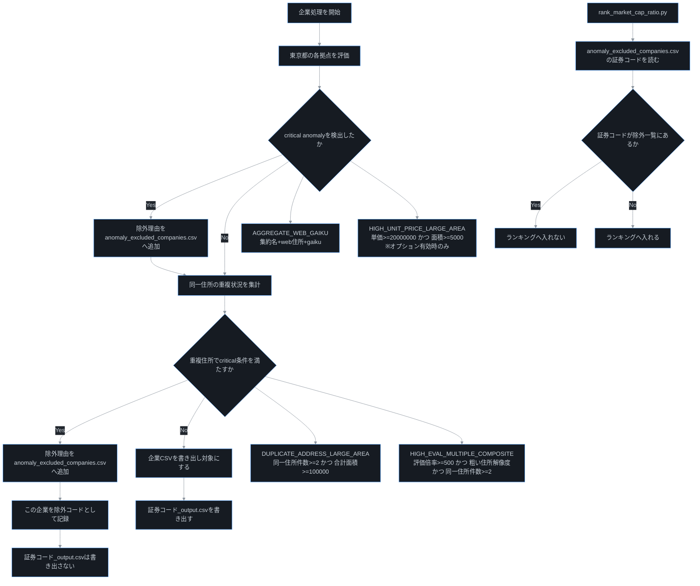

# land_value_research

## この文書の役割
このREADMEは, このツールを使う人向けの説明書です.
「何をするツールか」「どう実行するか」「結果をどう確認するか」をまとめています.
Codexの作業ルールは `AGENTS.md` に分けて書いてあります.

## 目的
有価証券報告書に書かれた土地情報を使って, 東京都の土地の推定時価を計算するツールです.
計算結果は, 会社ごとのCSV(`data/output/証券コード_output.csv`)として出力します.

## 対象と前提
- 対象は `config/input.csv` に書いた4桁の証券コードの企業です.
- 土地の評価対象は東京都だけです.
- 東京都以外の土地は, このツールでは評価しません.

## フォルダ構成
- `src/`: 本体ロジックです.
  - `run.py` から読み込まれる必須モジュールです.
- `scripts/`: 補助スクリプトです.
  - 検証や調査のための任意ツールです.
  - 通常運用(`python run.py ...`)では不要です.
- `config/`: 設定ファイルを置く場所です.
  - 例: `company_master.yaml`, `address_overrides.yaml`, `market_cap_overrides.csv`
- `data/output/`: 計算結果を置く場所です.
  - `証券コード_output.csv` やランキングファイルが入ります.
- `data/cache/`: 実行を速くするための一時データです.
  - `pdf/`: 有価証券報告書PDFを保存します.
  - `web_address/`: Web住所調査のキャッシュを保存します.
  - その他の中間計算結果を保存します.
- `data/geocoding/`: 住所を座標に変換するための参照データです(東京都2024).
- `data/landprice/tokyo_2025/`: 地価公示データです(東京都2025).

## 入力
`config/input.csv` は2形式に対応します.

最小形式(証券コードのみ):
```csv
4224
```

推奨形式(ヘッダ付き):
```csv
code,company_name,securities_report_pdf_url,market_cap,address_source_urls
9083,神姫バス株式会社,https://example.com/report.pdf,123456789000,https://example.com/ir|https://example.com/company
```

## 実行
基本コマンド:
```bash
python run.py --price-method idw --k 3 --p 3
```

補足:
- `run.py` は本体処理です.
- `scripts/` 配下は補助用途なので, 必要な時だけ実行します.

Web住所補完を使う場合:
```bash
python run.py --price-method idw --k 3 --p 3 --allow-web-address
```

## 主要オプション
- `--input`: 読み込む入力CSVです.
  - 省略すると `./config/input.csv` を使います.
- `--output`: 出力先フォルダです.
  - 省略すると `data/output` を使います.
- `--price-method`: 地価単価の計算方法です.
  - `idw` または `nearest` を指定できます.
  - 省略時は `idw` です.
- `--k`: `idw` で使う近傍点数です.
  - 省略時は `3` です.
- `--p`: `idw` の距離重み指数です.
  - 省略時は `3` です.
- `--eps`: ゼロ割を避けるための小さな値です.
  - 省略時は `1.0` です.
- `--geocode-factor-gaiku`: `gaiku` 解像度の地価補正係数です.
  - 省略時は `1.0` です.
- `--geocode-factor-oaza-chome`: `oaza_chome` 解像度の地価補正係数です.
  - 省略時は `0.95` です.
- `--geocode-factor-muni-centroid`: `muni_centroid` 解像度の地価補正係数です.
  - 省略時は `0.85` です.
- `--allow-download` / `--no-allow-download`: PDFの自動取得をON/OFFします.
- `--allow-web-address` / `--no-allow-web-address`: Web住所補完をON/OFFします.
- `--allow-auto-metadata` / `--no-allow-auto-metadata`: IRBANKによる不足情報補完をON/OFFします.
- `--enable-high-unit-price-large-area` / `--no-enable-high-unit-price-large-area`: `HIGH_UNIT_PRICE_LARGE_AREA` 除外判定をON/OFFします(既定はOFF).

## 除外判定フロー
`run.py` で企業を除外するかどうかの流れです.



補足:
- `異常値警告` は注意喚起で, 単独では除外しません.
- 除外された企業は `data/output/*_output.csv` が作成されず, `anomaly_excluded_companies.csv` に理由が残ります.

## 処理フロー
1. 入力企業リストを読みます.
2. 有価証券報告書から, 事業所ごとの住所, 面積, 簿価を取り出します.
3. 住所を緯度経度に変換します.
4. 地価公示データから地価単価を推定します(`idw`または`nearest`).
5. 推定土地時価, 含み益, 評価倍率, 時価総額比を計算します.
6. 企業ごとのCSVとランキングを出力します.

## 計算式
- 推定土地時価(円) = 地価単価(円/m2) x 土地面積(m2)
- 含み益(円) = 推定土地時価(円) - 土地簿価(円)
- 評価倍率 = 推定土地時価(円) / 土地簿価(円)
- 時価総額比 = 推定土地時価(円) / 時価総額(円)

## 住所上書き
- 手動で住所を指定する場合は `config/address_overrides.yaml` を使います.
- 形式は `証券コード -> 事業所名 -> 完全住所` です.
- 該当キーが一致した場合, 住所取得元は `override` になります.

## 出力
企業別CSV: `data/output/証券コード_output.csv`

主な列:
- 証券コード, 企業名, 事業所名, 住所
- 住所解決レベル, 土地面積(m2), 地価単価(円/m2)
- 地価単価算出方法, 公示点ID, 公示点距離(m)
- 推定土地時価(円), 土地簿価(円), 含み益(円), 評価倍率, 時価総額(円), 時価総額比
- 信頼度指標: `k近傍距離分散(m2)`, `k近傍最遠距離(m)`, `地価推定信頼度スコア`, `地価推定信頼度`
- 補正係数: `地価単価補正係数`, `住所解像度補正係数`
- 異常値検知: `異常値警告`
- 丸め分離: `評価倍率(実値)` と `時価総額比(実値)` を追加し, 表示列と分離

タグ一覧(主なカテゴリ列):
- `住所解決レベル`
  - `gaiku`: 街区レベルまで住所を解決できた状態です. 最も細かい解像度です.
  - `oaza_chome`: 大字・丁目レベルまで解決できた状態です. 街区よりは粗いです.
  - `muni_centroid`: 市区町村の代表点(重心)で評価した状態です. 最も粗いため保守係数を掛けます.
- `住所取得元`
  - `override`: `config/address_overrides.yaml` の手動指定住所を採用した状態です.
  - `web`: 会社Web等の公開情報から補完した住所を採用した状態です.
  - `securities_report`: 有価証券報告書の記載住所をそのまま使った状態です.
- `地価推定信頼度`
  - `high`: 近傍点との距離条件が良く, 相対的に信頼しやすい推定です.
  - `medium`: 中間的な信頼度です.
  - `low`: 距離条件が悪く, 慎重に扱うべき推定です.

ランキング:
- `python rank_market_cap_ratio.py`
- 出力: `data/output/ranking_market_cap_ratio.md`
- 仕様: `data/output/*_output.csv` を全件読み込みます.
- 集計時は, 各社の `東京都合計` 行を優先します.

## 検証方法(精度チェック)
1. 必要ならキャッシュを削除して, もう一度実行します.
2. 上位銘柄を手計算で再確認します.
3. 少なくとも次の式が一致するか確認します.
- `推定土地時価(円) = 面積 x 地価単価`
- `含み益(円) = 推定土地時価 - 土地簿価`
- `時価総額比 = 推定土地時価 / 時価総額`

## 学びと運用メモ
- 精度確認は, キャッシュを消して再実行し, 主要列の実値一致で判定します.
- ランキング確認は, `東京都合計`優先ロジックと元CSVの再照合をセットで実施します.
- `時価総額比`は丸め表示と内部実値が微差になるため, 判定はCSV実値を使います.
- 速度改善時は, 最適化前後の`*_output.csv`主要列が一致することを必ず確認します.
- 上位銘柄は, `data/cache/facilities_land/*.json`と一次資料で目視確認すると安全です.
- 作業前後は`git status`で差分を確認し, 意図したファイルのみを管理します.
