# Land Value Research - システム全体アーキテクチャ解説

東京都内の上場企業が保有する土地の**推定時価**を算出し、時価総額との比率でランキングする分析ツール。
有価証券報告書PDFから土地データを抽出し、公示地価データと住所ジオコーディングを組み合わせて含み益を推定する。

---

## 1. システム全体フロー
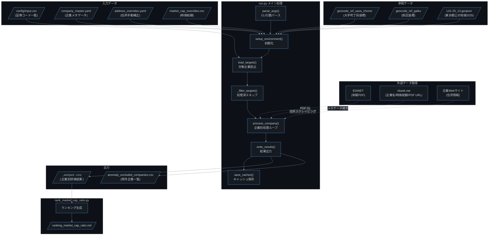

---

## 2. プロジェクト構造

```
land_value_research/
├── run.py                          # メインエントリポイント
├── rank_market_cap_ratio.py        # ランキングMarkdown生成
├── src/
│   ├── anomaly.py                  # 異常値検出・閾値定数・OutputRow型
│   ├── cache.py                    # JSONキャッシュI/O(アトミック書込み)
│   ├── pdf_extract.py              # 有報PDFからの設備テーブル抽出
│   ├── geocode_tokyo.py            # Rust拡張 land_value_core のラッパ
│   ├── jp_address.py               # 日本語住所正規化
│   ├── landprice_tokyo.py          # Rust拡張 land_value_core のラッパ
│   ├── web_address_research.py     # Webスクレイピングで住所補完
│   ├── web_cache.py                # PDFダウンロード/検証
│   ├── company_config.py           # YAML/CSV設定読込
│   ├── company_metadata_fallback.py# IRBankフォールバック
│   └── utils.py                    # ユーティリティ + SSRF保護
├── rust_src/
│   ├── lib.rs                      # Python拡張エントリ
│   ├── types.rs                    # PriceResult等の共通型
│   ├── jp_address.rs               # 住所正規化ロジック
│   ├── geocode_tokyo.rs            # 住所→緯度経度変換
│   ├── landprice_tokyo.rs          # 地価推定(IDW/最近傍)
│   └── coord.rs                    # 測地距離計算
├── config/
│   ├── company_master.yaml         # 企業マスタ(名前/PDF URL)
│   ├── address_overrides.yaml      # 住所手動オーバーライド
│   └── input.csv                   # 入力: 証券コード一覧
├── scripts/
│   ├── validate_ocr_accuracy.py    # OCR精度検証
│   └── split-address.ps1                # 並列住所解決
├── docs/
│   └── ARCHITECTURE.md             # システムアーキテクチャ詳細
└── data/
    ├── geocoding/                   # ジオコーディング参照CSV
    ├── landprice/tokyo_2025/        # 公示地価GeoJSON
    ├── cache/                       # 全種キャッシュ
    └── output/                      # 評価結果CSV + ランキングMD
```

---

## 3. 企業1社の処理フロー (`process_company`)

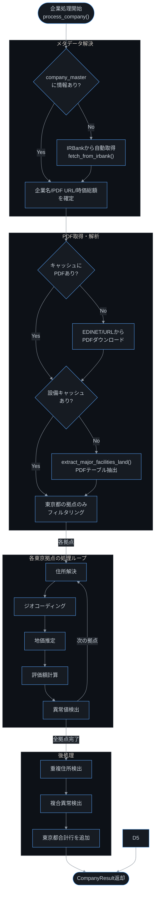

---

## 4. 住所解決フロー

有報PDFから得られる住所は「東京都中央区」のように市区までしかないことが多い。
より高精度な住所を3段階のソースから取得する。

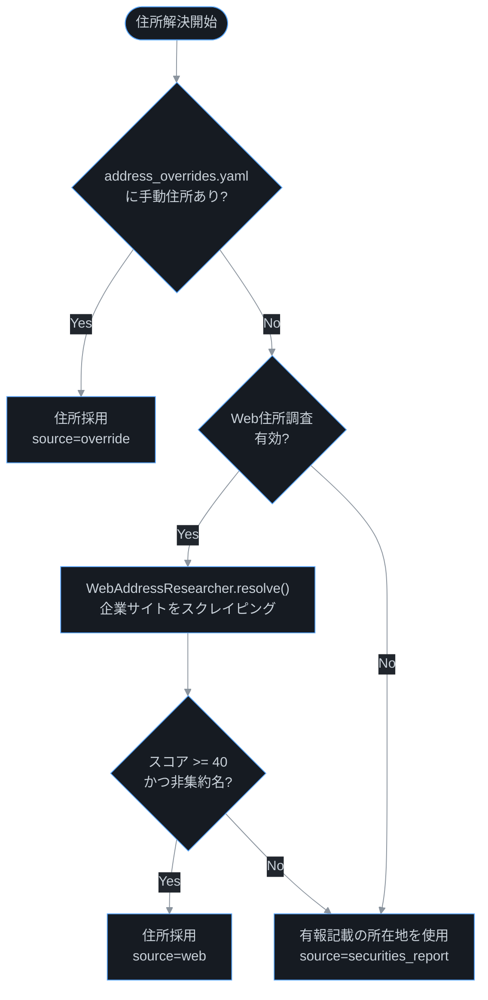

### Web住所スコアリング (`web_address_research.py`)

| 条件 | スコア |
|------|--------|
| 区市が住所に一致 | +20 |
| 区市が不一致 | -40 |
| 所在地(市区町村)が住所に含まれる | +30 |
| 丁目またはハイフンあり | +10 |
| 番地系情報あり (X番X号, X-X) | +20 |
| 丁目で終わる(粗い) | -5 |
| 拠点名が住所近傍のテキストに出現 | +40 |
| 区市がコンテキストに出現 | +10 |

---

## 5. ジオコーディングフロー (`geocode_tokyo.py`)

注: `src/geocode_tokyo.py` は `land_value_core.TokyoGeocoder` を公開する薄いラッパで、実処理は `rust_src/geocode_tokyo.rs` 側に実装されている。

住所文字列を緯度経度に変換する。精度レベルに応じて地価補正係数が適用される。

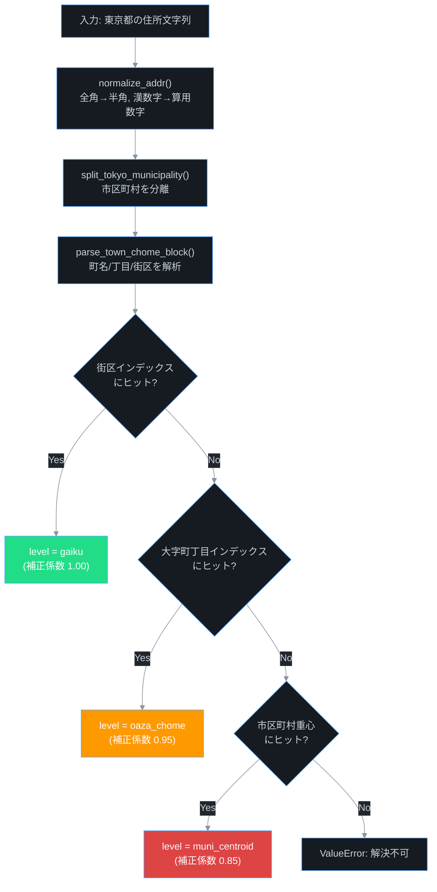

### 住所パース例

| 入力住所 | town | chome | block | 解決レベル |
|---------|------|-------|-------|-----------|
| 東京都中央区日本橋1丁目15番3号 | 日本橋 | 1 | 15 | gaiku |
| 東京都港区六本木3-4-33 | 六本木 | 3 | 4 | gaiku |
| 東京都渋谷区渋谷2丁目 | 渋谷 | 2 | - | oaza_chome |
| 東京都中央区 | - | - | - | muni_centroid |

---

## 6. 地価推定フロー (`landprice_tokyo.py`)

注: `src/landprice_tokyo.py` は `land_value_core.LandPriceTokyo` の薄いラッパで、実処理は `rust_src/landprice_tokyo.rs` 側に実装されている。

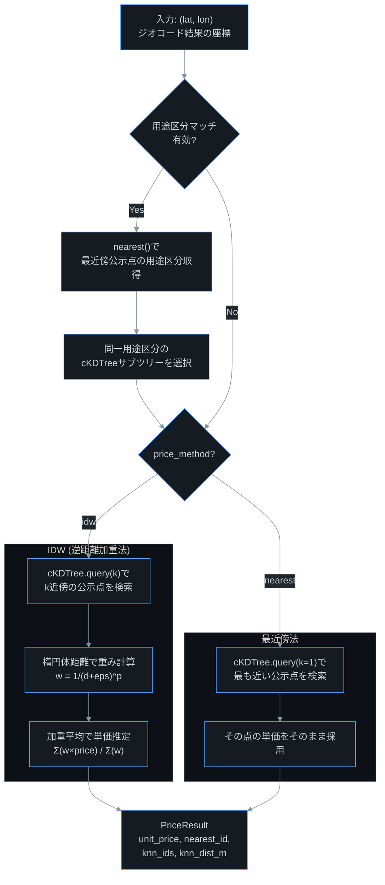

### IDW (Inverse Distance Weighting) 計算式

```
重み: w_i = 1 / (d_i + ε)^p

推定単価 = Σ(w_i × price_i) / Σ(w_i)

デフォルト: k=3, p=3, ε=1.0
```

### 信頼度スコア計算

```
max_component = min(最遠距離 / 5000, 1.0)
var_component = min(距離分散 / 1000000, 1.0)
score = max(0, min(1, 1 - (0.7 × max_component + 0.3 × var_component)))

信頼度ラベル:
  score >= 0.67 → "high"
  score >= 0.34 → "medium"
  score <  0.34 → "low"
```

---

## 7. 評価額の計算

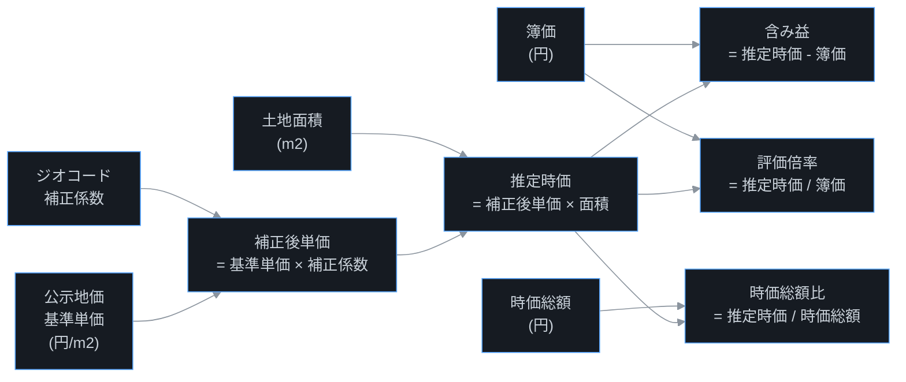

| 指標 | 計算式 | 意味 |
|------|--------|------|
| 補正後単価 | `基準単価 × geocode_factor` | 住所精度に応じた割引 |
| 推定土地時価 | `補正後単価 × 面積` | 土地の市場推定価格 |
| 含み益 | `推定時価 - 簿価` | 帳簿価額との差額 |
| 評価倍率 | `推定時価 / 簿価` | 簿価に対する時価の倍率 |
| 時価総額比 | `推定時価 / 時価総額` | 株式時価総額に対する土地比率 |

---

## 8. PDF抽出フロー (`pdf_extract.py`)

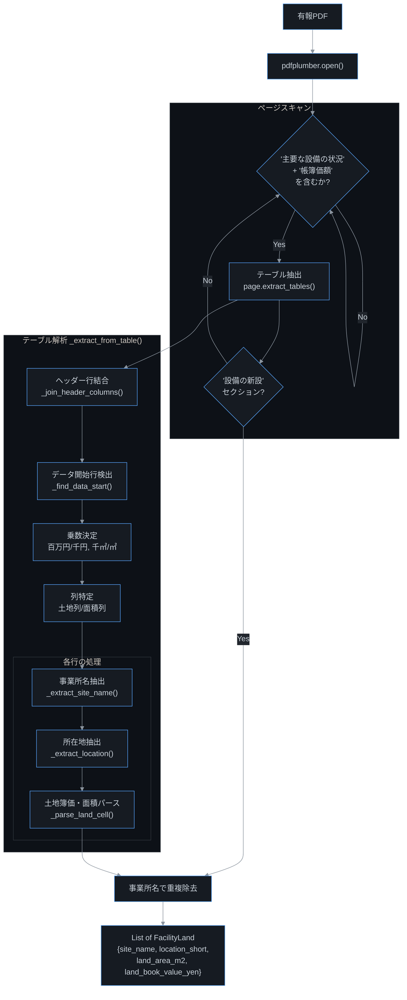

### FacilityLand データ構造

```python
@dataclass
class FacilityLand:
    site_name: str           # 例: "本社", "東京支店"
    location_short: str      # 例: "東京都中央区"
    land_area_m2: float      # 土地面積 (m2)
    land_book_value_yen: float  # 帳簿価額 (円)
```

---

## 9. 異常値検出ロジック

```mermaid
%%{init: {"theme":"base","themeVariables":{"background":"#0d1117","primaryColor":"#161b22","primaryTextColor":"#c9d1d9","primaryBorderColor":"#58a6ff","secondaryColor":"#21262d","tertiaryColor":"#30363d","lineColor":"#8b949e","clusterBkg":"#0d1117","clusterBorder":"#30363d"}}}%%
flowchart TD
    subgraph CRITICAL["Critical異常 → 記録のみ(除外しない)"]
        C1["AGGREGATE_WEB_GAIKU<br>集約名拠点 + web住所 + 街区解決"]
        C2["HIGH_UNIT_PRICE_LARGE_AREA<br>単価≥2000万 + 面積≥5000m2<br>(デフォルト無効)"]
        C3["DUPLICATE_ADDRESS_LARGE_AREA<br>同一住所に2拠点以上 + 合計面積≥10万m2"]
        C4["HIGH_EVAL_MULTIPLE_COMPOSITE<br>倍率≥500 + 粗ジオコード + 同一住所2拠点以上"]
    end

    subgraph WARNING["Warning異常 → フラグのみ"]
        W1["muni_centroid + 面積≥1万m2"]
        W2["oaza_chome + 面積≥5万m2"]
        W3["k近傍最遠距離≥1万m"]
        W4["信頼度low + 面積≥5000m2"]
        W5["評価倍率≥500 (単独)"]
        W6["同一住所 + 大面積の複数拠点"]
    end

    C1 --> LOG["anomaly_excluded_companies.csvに記録<br>企業はランキングに含む"]
    C2 --> LOG
    C3 --> LOG
    C4 --> LOG

    W1 --> FLAG["異常値警告列に記録<br>output CSVに含む"]
    W2 --> FLAG
    W3 --> FLAG
    W4 --> FLAG
    W5 --> FLAG
    W6 --> FLAG

    style LOG fill:#f90,color:#fff
    style FLAG fill:#f90,color:#fff
```

### 異常検出の閾値一覧

| 定数名 | 値 | 用途 |
|--------|-----|------|
| `WEB_ADDRESS_SCORE_MIN` | 40 | Web住所の最低信頼スコア |
| `CRITICAL_UNIT_PRICE_YEN_PER_M2` | 20,000,000 | 高単価閾値 (円/m2) |
| `CRITICAL_AREA_M2` | 5,000 | 大面積閾値 (m2) |
| `CRITICAL_EVAL_MULTIPLE` | 500 | 高評価倍率閾値 |
| `DUPLICATE_ADDRESS_WARNING_AREA_M2` | 50,000 | 重複住所警告閾値 (m2) |
| `DUPLICATE_ADDRESS_CRITICAL_AREA_M2` | 100,000 | 重複住所除外閾値 (m2) |
| `UNCERTAINTY_MAX_DIST_REF_M` | 5,000 | 信頼度計算の基準最遠距離 |
| `UNCERTAINTY_DIST_VAR_REF_M2` | 1,000,000 | 信頼度計算の基準分散 |

---

## 10. キャッシュ戦略

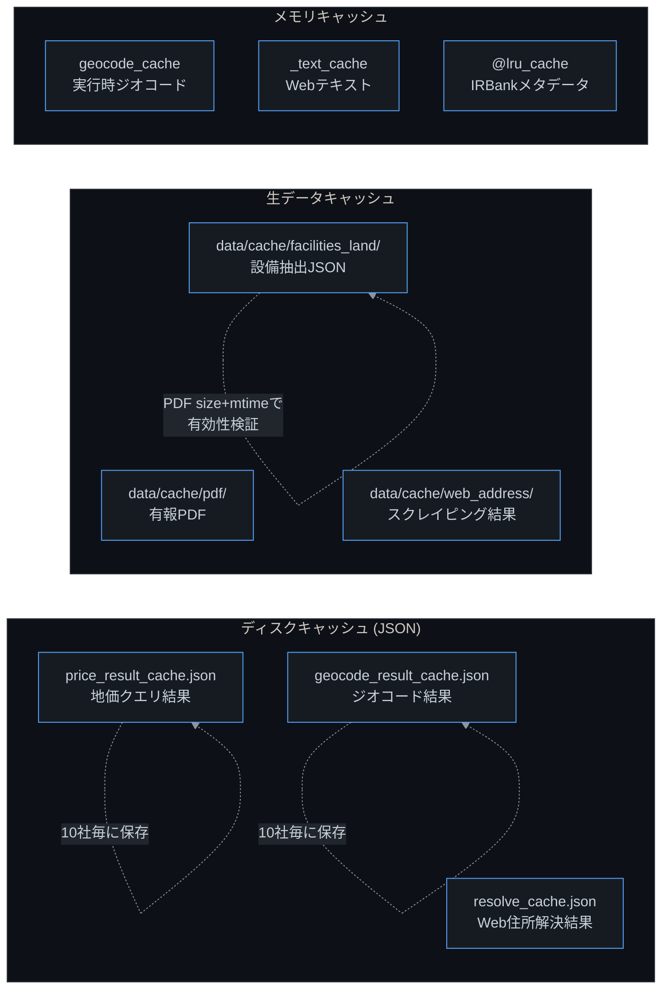

### キャッシュキー設計

| キャッシュ | キー | 値 |
|-----------|------|-----|
| 地価 | `lat\|lon\|method\|k\|p\|eps\|landuse_kind` | PriceResult相当のdict |
| ジオコード | 住所文字列 | `[lat, lon, level]` |
| Web住所 | `site_name\|location_short\|url1\|\|url2` | AddressCandidate相当のdict |
| 設備 | 証券コード (PDFのsize+mtimeで検証) | FacilityLandのリスト |

---

## 11. ランキング生成フロー (`rank_market_cap_ratio.py`)

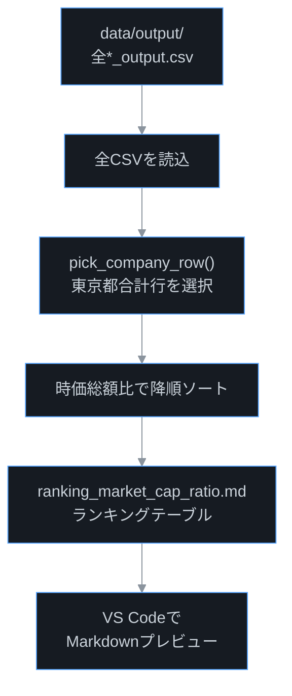

---

## 12. データフロー全体図

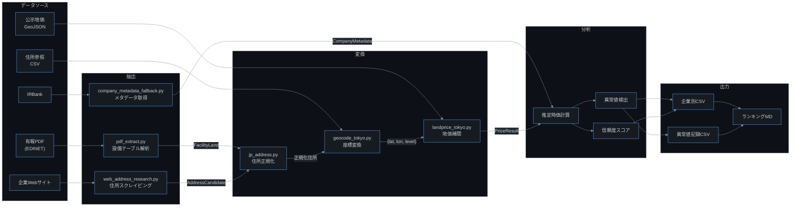

---

## 13. CLIオプション一覧

| オプション | 型 | デフォルト | 説明 |
|-----------|-----|-----------|------|
| `--input` | str | "" (未指定時は `config/input.csv`) | 入力CSVパス |
| `--output` | str | data/output | 出力ディレクトリ |
| `--price-method` | idw/nearest | idw | 地価推定方法 |
| `--k` | int | 3 | k近傍数 |
| `--p` | int | 3 | IDW距離の冪乗指数 |
| `--eps` | float | 1.0 | IDWのゼロ除算防止値 |
| `--geocode-factor-gaiku` | float | 1.00 | 街区レベル補正係数 |
| `--geocode-factor-oaza-chome` | float | 0.95 | 町丁目レベル補正係数 |
| `--geocode-factor-muni-centroid` | float | 0.85 | 市区町村重心補正係数 |
| `--allow-download` | bool | True | PDF自動ダウンロード |
| `--allow-web-address` | bool | True | Web住所調査 |
| `--allow-auto-metadata` | bool | True | IRBank自動補完 |
| `--skip-processed` | bool | True | 処理済スキップ |
| `--landuse-match` | bool | True | 用途区分マッチ |
| `--enable-high-unit-price-large-area` | bool | False | 高単価大面積除外 |

---

## 14. 出力CSVカラム (33列)

### 企業別出力 (`<code>_output.csv`)

| # | カラム名 | 説明 |
|---|---------|------|
| 1 | 証券コード | 4桁コード |
| 2 | 企業名 | 会社名 |
| 3 | 事業所名 | 拠点名 or "東京都合計" |
| 4 | 住所 | 解決された住所 |
| 5 | 住所取得元 | override / web / securities_report |
| 6 | 住所取得元URL | Web取得時のURL |
| 7 | 住所解決レベル | gaiku / oaza_chome / muni_centroid |
| 8 | 土地面積(m2) | 有報記載の面積 |
| 9 | 地価単価(円/m2) | 補正後の推定単価 |
| 10 | 地価単価補正係数 | 地価単価への補正 |
| 11 | 住所解像度補正係数 | ジオコード精度による割引率 |
| 12 | 地価単価算出方法 | idw(k=3,p=3)+landuse_match 等 |
| 13-14 | 基準/最近傍用途区分 | 土地利用種別 |
| 15-16 | 公示点ID/距離 | 最近傍公示地価点 |
| 17-20 | k近傍 ID/用途/距離/単価 | k-NNの詳細情報 |
| 21-22 | k近傍距離分散/最遠距離 | 推定の不確実性 |
| 23-24 | 信頼度スコア/ラベル | high/medium/low |
| 25 | 異常値警告 | 警告メッセージ |
| 26 | 推定土地時価(円) | 面積×単価 |
| 27 | 土地簿価(円) | 有報記載の帳簿価額 |
| 28 | 含み益(円) | 時価-簿価 |
| 29-30 | 評価倍率(実値/表示) | 時価/簿価 |
| 31 | 時価総額(円) | 株式時価総額 |
| 32-33 | 時価総額比(実値/表示) | 土地時価/時価総額 |

---

## 15. 実行例

```bash
# 基本実行 (全デフォルトオプション)
python run.py

# IDW k=5, p=2 で地価推定
python run.py --price-method idw --k 5 --p 2

# Web住所調査を無効化
python run.py --no-allow-web-address

# ランキング生成
python rank_market_cap_ratio.py
```

### 処理の流れ (コンソール出力例)

```
[1/326] 開始: 1810 松井建設
[1/326] 拠点: 全3件, 東京都対象2件
[1/326][1/2] 解析中: 1810 本社
[1/326][2/2] 解析中: 1810 東京支店
[1/326] 完了: 1810 東京都拠点2件, 推定時価合計5,432,100,000円
[2/326] 開始: 1878 大東建託
...
```

---

## 16. モジュール依存関係

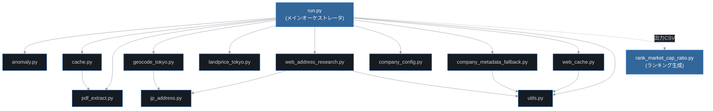

---

## 17. 外部依存ライブラリ

| ライブラリ | 用途 |
|-----------|------|
| `pdfplumber` | 有報PDFのテーブル抽出 |
| `pandas` | ジオコーディング参照CSVの読込・インデックス構築 |
| `geopandas` | 公示地価GeoJSONの読込 |
| `pyproj` | WGS84楕円体上の測地距離計算 |
| `scipy` | cKDTreeによるk近傍空間インデックス |
| `numpy` | IDW計算, k-NN距離計算 |
| `pyyaml` | YAML設定ファイル読込 |
